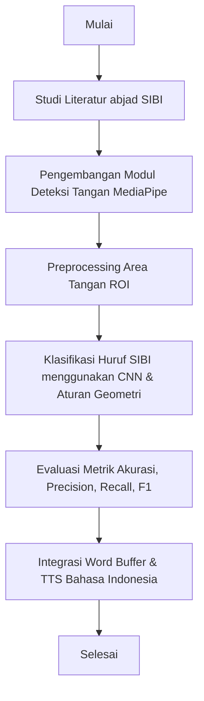
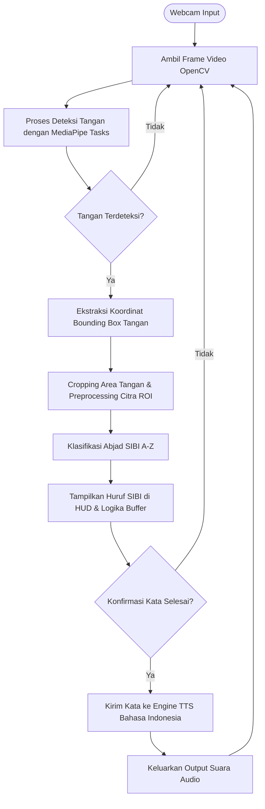

# Rancangan Tugas Akhir (TA)

**Judul:**  
`Pengembangan Sistem Pengenalan Bahasa Isyarat Berbasis Computer Vision dan Machine Learning Menggunakan CNN dan MediaPipe`

---

## 1. Pendahuluan

### 1.1 Latar Belakang
Komunikasi merupakan kebutuhan fundamental manusia untuk berinteraksi, bertukar informasi, dan mengekspresikan diri. Bagi penyandang tunarungu dan tunawicara (Teman Tuli) di Indonesia, salah satu sistem bahasa isyarat formal yang diresmikan oleh pemerintah untuk digunakan dalam pendidikan formal (Sekolah Luar Biasa/SLB) adalah **SIBI (Sistem Isyarat Bahasa Indonesia)**. 

SIBI menggunakan gerakan **satu tangan** (tangan kanan) untuk mengeja huruf alfabet A–Z. Penggunaan satu tangan dalam SIBI dirancang untuk mempermudah visualisasi komunikasi bahasa secara formal, menyamai tata bahasa lisan Indonesia. Namun, mayoritas masyarakat umum di Indonesia tidak memahami bahasa isyarat SIBI ini, sehingga memicu hambatan komunikasi (*communication gap*) yang menyulitkan Teman Tuli dalam mengakses layanan publik seperti kesehatan, administrasi, dan pendidikan.

Dengan perkembangan teknologi kecerdasan buatan (*Artificial Intelligence*), khususnya di bidang *Computer Vision* dan *Machine Learning*, peluang untuk mengatasi hambatan komunikasi ini semakin terbuka lebar melalui penerjemahan bahasa isyarat secara otomatis.

Penelitian ini memfokuskan pengembangan pada pengenalan alfabet jari **SIBI** karena formatnya yang menggunakan satu tangan sangat kompatibel dengan kemampuan pelacakan tangan secara real-time dari framework **MediaPipe Hands** dan klasifikasi pola **Convolutional Neural Network (CNN)**. Sistem ini dirancang untuk mendeteksi koordinat tangan kanan, mengekstrak area tangan (ROI), dan mengklasifikasikan huruf SIBI (A–Z) secara *real-time*. Aplikasi ini dilengkapi dengan logika penyusunan huruf menjadi kata (*word composition*) dan konversi teks menjadi suara (*Text-to-Speech*) dalam bahasa Indonesia untuk mempermudah komunikasi dua arah.

### 1.2 Rumusan Masalah
Berdasarkan latar belakang di atas, rumusan masalah dalam tugas akhir ini adalah:
1. Bagaimana mengimplementasikan framework MediaPipe Hands untuk mendeteksi dan melacak tangan kanan secara presisi pada input video *real-time* dari webcam?
2. Bagaimana merancang dan melatih arsitektur model *Convolutional Neural Network* (CNN) menggunakan dataset alfabet SIBI agar mampu mengklasifikasikan huruf SIBI A–Z dengan tingkat akurasi yang tinggi?
3. Bagaimana menyusun huruf-huruf SIBI hasil klasifikasi real-time menjadi kata yang utuh dan mengonversinya menjadi output suara (*Text-to-Speech*) dalam bahasa Indonesia?

### 1.3 Tujuan Penelitian
Tujuan dari penelitian tugas akhir ini adalah:
1. Membangun modul deteksi dan pelacakan tangan kanan secara *real-time* menggunakan MediaPipe Hands untuk memotong dan menormalisasi area tangan dari input webcam.
2. Mengembangkan dan melatih model CNN untuk mengklasifikasikan 26 kelas alfabet SIBI (A–Z) secara optimal.
3. Mengimplementasikan fitur penyusunan huruf menjadi kata (*word composition*) dan konversi teks menjadi suara (*Text-to-Speech* / TTS) dalam bahasa Indonesia secara *real-time*.

### 1.4 Manfaat Penelitian
- **Bagi Teman Tuli:** Menyediakan alat bantu komunikasi interaktif yang dapat menerjemahkan abjad jari SIBI secara langsung menjadi teks dan suara bagi masyarakat umum.
- **Bagi Guru & Siswa SLB:** Membantu proses belajar-mengajar abjad jari SIBI dengan umpan balik visual langsung dari webcam secara mandiri.
- **Bagi Perkembangan Ilmu Pengetahuan:** Memberikan referensi akademis mengenai integrasi deteksi geometri sendi (MediaPipe) dan CNN khusus untuk bahasa isyarat lokal (SIBI).

---

## 2. Tinjauan Pustaka

### 2.1 abjad Jari SIBI
SIBI menggunakan abjad jari satu tangan statis untuk mengeja huruf A–Z. Setiap huruf dibentuk dari konfigurasi posisi jari tangan kanan (misalnya, melengkung membentuk lingkaran untuk O, telunjuk tegak untuk D, atau jempol-telunjuk siku untuk L).

### 2.2 MediaPipe Hands
MediaPipe Hands mendeteksi keberadaan tangan kanan secara *real-time* dan melacak **21 koordinat sendi tangan 3D** (keypoints). Titik-titik koordinat ini digunakan untuk menganalisis geometri status jari (apakah jari tertekuk atau terbuka) secara cepat dan efisien.

---

## 3. Metodologi Penelitian

---

## 4. Perancangan Sistem

### 4.1 Diagram Alur Sistem (System Flowchart)
Diagram berikut menjelaskan alur pemrosesan dari tangkapan kamera hingga suara dihasilkan dalam sistem SIBI:

### 4.2 Arsitektur Model CNN
Arsitektur CNN menggunakan model *sequential* berurutan dengan layer Conv2D untuk ekstraksi fitur spasial dan Dense/Fully Connected untuk klasifikasi probabilitas kelas alfabet SIBI.

| Layer (Type) | Bentuk Output | Parameter / Konfigurasi |
| :--- | :--- | :--- |
| **Input Layer** | (None, 64, 64, 3) | Citra RGB 64x64 piksel |
| **Conv2D_1** | (None, 64, 64, 32) | 32 Filter (3x3), Activation: ReLU |
| **MaxPooling2D_1** | (None, 32, 32, 32) | Pool Size (2x2) |
| **Conv2D_2** | (None, 32, 32, 64) | 64 Filter (3x3), Activation: ReLU |
| **MaxPooling2D_2** | (None, 16, 16, 64) | Pool Size (2x2) |
| **Conv2D_3** | (None, 16, 16, 128) | 128 Filter (3x3), Activation: ReLU |
| **MaxPooling2D_3** | (None, 8, 8, 128) | Pool Size (2x2) |
| **Flatten** | (None, 8192) | Pengubahan ke vektor 1D |
| **Dense (FC_1)** | (None, 256) | 256 Neuron, Activation: ReLU |
| **Dropout** | (None, 256) | Rate = 0.5 (Mencegah Overfitting) |
| **Output Layer** | (None, 26) | 26 Neuron, Activation: Softmax |
